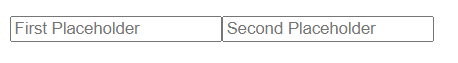
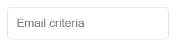
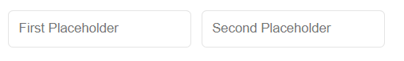
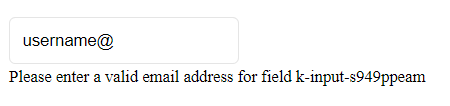
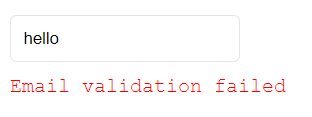

# Kriterion

---

[](https://www.npmjs.com/package/@ebenjs/kriterion)
[](https://www.npmjs.com/package/@ebenjs/kriterion)
[](https://www.npmjs.com/package/@ebenjs/kriterion)

---

Kriterion is a powerful validation library designed specifically for developers using Vue.js. Simplify the user data validation process with this elegant and flexible solution. Whether you're building complex forms or interactive user interfaces, Kriterion lets you ensure that user-entered data meets required criteria before it's processed.

## Main Features
- **Seamless Integration:** Easily integrate Kriterion into your existing Vue.js projects, enjoying seamless integration with components and templates.


- **Custom Validation:** Create custom validation rules for your form fields, based on your specific needs. Define criteria such as length, format, minimum/maximum values, etc.


- **Vue.js responsiveness:** Leverage the native responsiveness of Vue.js to instantly display validation error messages to users, improving user experience.


- **Real-Time Validation:** Take advantage of real-time validation to give users instant feedback as they fill out forms, reducing errors and incorrect submissions.


- **Advanced Error Handling:** Elegantly handle validation error messages by customizing them to your UI needs. Display clear and understandable messages to guide users.

## Installation
Install Kriterion using npm:
```bash
npm install @ebenjs/kriterion
```

## Usage
Import Kriterion into your Vue.js project in your main.js file:
```javascript
import Kriterion from '@ebenjs/kriterion'
```
Then register it as a Vue.js plugin:
```javascript
import Kriterion from "@ebenjs/kriterion";

const app = createApp(App);

app.use(Kriterion);

app.mount('#app')
```

Now you can use Kriterion in your Vue.js components:
```html
<template>
  <div>
    <k-validator :activate-errors="true">
      <k-input
        placeholder="Validate Number"
        validationType="number"
        :min="5"
        :max="8"
        numberType="int">
        
        <template v-slot:error>Custom error message</template>

      </k-input>
    </k-validator>
  </div>
</template>
```
## Getting started

### Components

- `k-validator` : An optional component that wraps the other two components. Aggregates validation results from child components.
  
- `k-input` : The main component to which the props we add to it will constitute the validation criteria.

- `k-password` : A component encompassing two k-input components with a predisposition to passwords.

### Validation types

Depending on your needs, you can define the type of validation you wish to apply to a `k-input` field by specifying the validationType prop.

The following types of validation are possible: 

`['alpha', 'alphanum', 'number', 'email', 'phone', 'password']`

#### Global validation

The only possible global validation (valid for all fields of type k-input) is the required criteria.
To make a field required, you need to add the `isRequired` prop.

```javascript
  <k-input
    placeholder="Required field"
    :isRequired="true">
  </k-input>
```
#### Numerical validation

For numeric types, we have a few props that enable us to refine the validation criteria. They are as follows

- `min`: Minimum value for numeric types.
  
- `max`: Maximum value for numeric types.

- `numberType`: Number type (int, float) for numeric types.
  
- `hasNegativeValues`: If this prop is set, the field accepts negative numbers.

Here's how we can add a numeric field that accepts floating numbers and has a minimum value of -20.0 and a maximum value of 100.0

```javascript
  <k-input
    placeholder="Numerical criteria"
    :isRequired="true"
    validationType="number"
    numberType="float"
    :hasNegativeValues="true"
    :min="-20.0"
    :max="100.0">
  </k-input>
```
As you can see, all validation criteria are defined using props.

#### Alphabetical validation

The following props are used to define validation criteria for alphabetical fields.

- `validationType`: *alpha* or *alphanum*
  
- `minLength`: Minimum length for alpha and alphanum types.
  
- `maxLength`: Maximum length for alpha and alphanum types.

- `hasSpace`: If this prop is set, it allows spaces.
  
- `hasNumerical`: If this prop is set, it allows numerical values. Even if the field had been defined for alpha validation, it will now support alphanumeric validation.

Here's an example of how we can define a field that accepts alphanumeric values without spaces:

```javascript
  <k-input
    placeholder="Alphanum criteria"
    :isRequired="true"
    validationType="alphanum"
    :hasSpace="false">
  </k-input>

  // Will accept 'Hello123' but not 'Hello 123'
```

#### Phone number validation

To validate a phone number field, we need to set the validationType prop to `phone`. Then we have the choice of the following props to further our validation criterion :

- `digits`: Number of digits for telephone numbers.
  
- `hasPlusSign`: Indicates whether the phone number should begin with a plus sign. Useful if you need to specify area codes.

Here is an example of a field that accepts a 12-digit phone number,  including the area code (+ sign needed).

```javascript
<k-input
  placeholder="PhoneNumber criteria"
  validationType="phone"
  :hasPlusSign="true"
  :digits="12">
</k-input>
```

#### Email validation

Mail validation is as simple as setting the validationType prop to email

```javascript
<k-input
  placeholder="Email criteria"
  validationType="email">
</k-input>
```

#### Password validation

The `k-password` component makes it very easy to validate passwords. This component generates two `k-input` elements for the password and confirmation fields. However, you can skip this component and just use a k-input with the necessary props to achieve the same result. The k-password component is still intended to make your life easier.

The following props can be used to define a validation criterion for a password field:

- `minlength`: The minimum length of the password. The default is 8 characters.
  
- `hasLowerCase`: Should the password contain lowercase letters?
  
- `hasUpperCase`: Does the password have to contain capital letters?

- `hasNumber`: Does the password have to contain numbers?
  
- `hasSpecialChar`: Does the password have to contain special characters?

Here's a very simple example of how to use the k-password component for a 12-character password that must contain lowercase letters, uppercase letters and numbers.

```javascript
<k-password
  :hasNumerical="true"
  :hasLowerCase="true"
  :hasUpperCase="true"
  :hasSpecialChar="false"
  :minLength="12"
  :placeholder="{
    first: 'First Placeholder',
    second: 'Second Placeholder'
  }">

</k-password>
```
Here is the simplistic rendering result



You will notice that we have specified the placeholder prop for the k-password component. This allowed us to define the placeholders of our child components.
Note that everything is customisable in kriterion. From custom css classes and styles for our fields to catching errors and displaying them.

## Customization

### Styles

The `k-input` and `k-password` components can be customized using css styles. We can use the `class` prop to pass them css classes or the `style` prop to apply css properties directly to them.

As an example, here is how we can apply css properties to a `k-input` component :

```javascript
<k-input
  placeholder="Email criteria"
  validationType="email"
  style="border: solid 1px rgba(0,0,0,0.1);
    padding: 10px;
    border-radius: 5px">
</k-input>
```

Here is the rendering result



And here is an example of how we can apply css classes to a `k-password` component :

```javascript
<k-password
  class='custom-input-style'
  :hasNumerical="true"
  :hasLowerCase="true"
  :hasUpperCase="true"
  :hasSpecialChar="true"
  :placeholder="{ 
    first: 'First Placeholder',
    second: 'Second Placeholder' 
    }"
  >
</k-password>

<style>
.custom-input-style {
  border: solid 1px rgba(0,0,0,0.1);
  padding: 10px;
  border-radius: 5px;
}

.custom-input-style:not(:first-child) {
  margin-left: 10px;
}
</style>

```

Here is the rendering result



### Errors slots

By default, error messages are displayed directly at the bottom of each form field. But we can change how we want to display these error messages by using the `slots` provided.

Here is for example how an error is displayed by default for an invalid email type field:



For `k-input` components, we just need to fill in the default slot if you want to display errors differently.

For example:

```html
<k-input
  placeholder="Custom error message"
  class="custom-input-style"
  validationType="email">
  <!-- We add a slot -->
  <div class="error">Email validation failed</div>
</k-input>

<style scoped>
.error{
  color: red;
  margin-top: 10px;
  font-family: 'Courier New', Courier, monospace;
}
</style>

```

And the result looks like this when there is a validation error:



For `k-password` type components, error messages are displayed mainly next to the first password field. The only situation in which a message is displayed next to the second password field is when the two passwords do not match.

However, two slots are available: `first-custom-error` and `second-custom-error`. You are free to customise the messages if you wish.